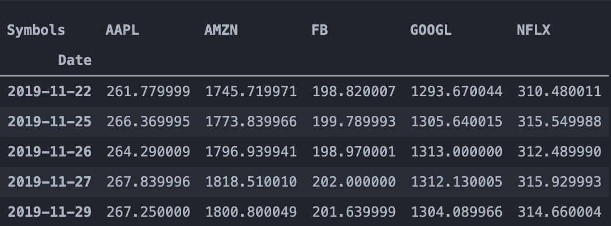

# FAANG - Stock Analysis

#### Load Data from Yahoo Finance

Pandas Web Reader is an extension of pandas library that imports data from several sources including Yahoo Finance, Quandl, Enigma, NASDAQ,etc.

We can import the stock prices using the following libraries:

```import pandas as pd
import datetime
import pandas_datareader.data as web
from pandas import Series, DataFrame
```

Define the start and end date and import the stocks for FAANG:

```start = datetime.datetime(2014, 1, 1)
end = datetime.datetime(2019, 11, 30)
df = web.DataReader(["AAPL","AMZN","FB","NFLX","GOOGL"], 'yahoo', start, end)
```



The code will pull the last 5 years of data from Jan, 2014 until Nov,2019. I decided to create a new table (AdjClose) where I stored the data for the adjusted prices for each individual stock. You can plot the stocks and their respective prices using the code:

``` %matplotlib inline
import matplotlib.pyplot as plt
from matplotlib import style

# Adjusting the size of matplotlib
import matplotlib as mpl
mpl.rc('figure', figsize=(8, 8))
mpl.__version__

# Adjusting the style of matplotlib
style.use('ggplot')

AdjClose.plot(label='FAANG')
plt.legend()
```


If we look at the graph we can see that Amazon is the clear winner from the group, however it is difficult to compare companies based on stock prices. The next step is to calculate the monthly returns and plot them:

```monthly_returns = AdjClose.resample('M').ffill().pct_change()
fig = plt.figure()
ax1 = fig.add_subplot(321)
ax2 = fig.add_subplot(322)
ax3 = fig.add_subplot(323)
ax4 = fig.add_subplot(324)
ax5 = fig.add_subplot(325)
ax1.plot(monthly_returns['AMZN'])
ax1.set_title("Amazon")
ax2.plot(monthly_returns['AAPL'])
ax2.set_title("Apple")
ax3.plot(monthly_returns['FB'])
ax3.set_title("Facebook")
ax4.plot(monthly_returns['NFLX'])
ax4.set_title("Netflix")
ax5.plot(monthly_returns['GOOGL'])
ax5.set_title("Google")
plt.tight_layout()
plt.show()
```


Now that we have the monthly returns we can also figure out the total return for each stock and check the return of $1 after 5 years in each one of them:

```cum_returns = (monthly_returns + 1).cumprod()


fig = plt.figure()
ax1 = fig.add_axes([0.1,0.1,0.8,0.8])
cum_returns.plot()
ax1.set_xlabel("Date")
ax1.set_ylabel("Growth of $1 investment")
ax1.set_title("FAAG daily cumulative returns data")
plt.show()
```


#### Credits

[In 12 minutes: Stocks Analysis with Pandas and Scikit-Learn](https://towardsdatascience.com/in-12-minutes-stocks-analysis-with-pandas-and-scikit-learn-a8d8a7b50ee7)

[How to calculate stock returnss in Python](https://www.codingfinance.com/post/2018-04-03-calc-returns-py/)

<!Add Codacy Badge!>

[](https://www.codacy.com/manual/tmcbrigido/faang-stock?utm_source=github.com&amp;utm_medium=referral&amp;utm_content=tmcbrigido/faang-stock&amp;utm_campaign=Badge_Grade)